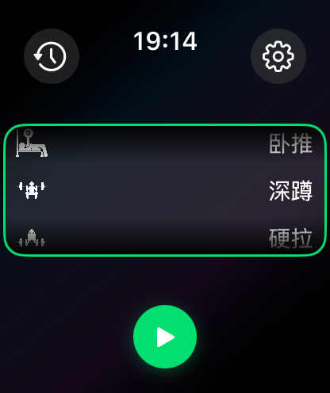
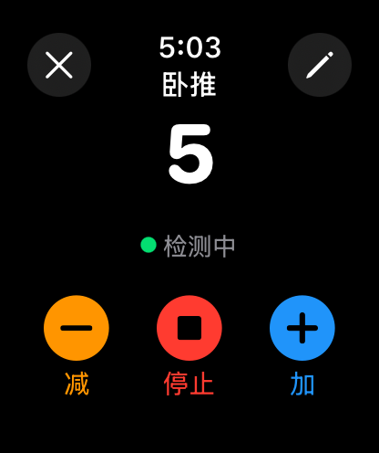
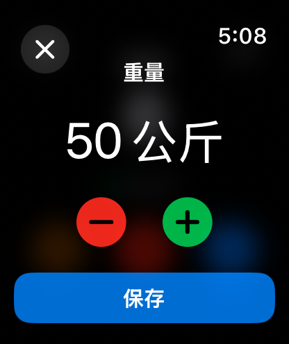
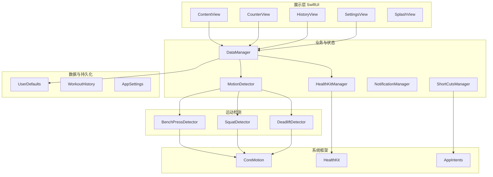

# GymCount - 健身计数器

基于 Apple Watch 的智能力量训练计数应用，用加速度计自动识别卧推、深蹲、硬拉等动作，让手表数每一次努力。

---

# 项目简介

GymCount（健身计数器）是一款专为健身与力量训练用户打造的 **WatchOS 原生应用**。通过设备内置的 CoreMotion 加速度计实时分析运动轨迹，在无需手动点击的情况下自动完成重复次数统计，并与 Apple 健康应用（HealthKit）同步，帮助用户闭环运动圆环、追踪长期训练数据。

- **项目目标**：在手腕上提供「开始即用」的自动计数体验，减少锻炼时的操作负担，并形成可追溯的锻炼历史与周统计。
- **使用场景**：健身房或居家进行卧推、深蹲、硬拉等力量训练时，佩戴 Apple Watch 即可自动计数、记录重量与时长，并在结束后查看历史与图表。
- **核心能力**：基于加速度计的动作识别、多运动类型支持、重量与体重配置、本地历史与周统计图表、HealthKit 同步、Siri/快捷指令集成、中英文本地化。

---

# 项目截图

（可从 App Store 或实际运行截图中补充）





---

# 技术栈

| 层级 | 技术 |
|------|------|
| 应用层 | Swift 5.9、SwiftUI（声明式 UI） |
| 框架与库 | CoreMotion（运动检测）、HealthKit（健康数据）、Combine（响应式）、WatchKit |
| 系统服务 | UserDefaults（持久化）、App Intents（Siri/快捷指令）、UserNotifications |
| 数据与存储 | 本地 JSON 编码 + UserDefaults，无后端数据库 |
| AI / 机器学习 | 无；运动识别基于规则与信号处理（加速度计波形分析） |

---

# 系统架构

应用采用 **MVVM** 与单例数据管理，整体分为展示层、业务层、数据层与检测层，数据自下而上流动，用户操作与运动检测事件驱动界面更新。

- **整体架构**：SwiftUI 视图订阅 `DataManager` 与各 Manager 的 `@Published` 状态；`DataManager` 统一持有 `MotionDetector`、`HealthKitManager`、`AppSettings` 与锻炼历史，负责会话生命周期、持久化与 HealthKit 写入。
- **数据流**：开始锻炼 → 选择运动类型 → `MotionDetector` 按类型切换对应检测器（卧推/深蹲/硬拉）→ 加速度计数据进入检测器 → 识别到一次有效重复 → 回调 `DataManager.addRep()` → 更新 `currentSession` 与 UI；结束锻炼 → 会话写入 `workoutHistory` 并持久化，可选同步至 HealthKit。
- **服务关系**：`DataManager` 为中枢；`MotionDetector` 依赖 CoreMotion；`HealthKitManager` 独立与 HealthKit 交互；各 View 通过 `@EnvironmentObject` 使用 `DataManager` 与 `NotificationManager`。



---

# 项目结构

```
GymCount/
├── GymCount.xcodeproj/          # Xcode 工程与配置
├── GymCount Watch App/          # Watch 应用主目录
│   ├── GymCountApp.swift        # 应用入口，根 Scene 与首次启动/权限
│   ├── Models.swift             # 数据模型：ExerciseType, RepRecord, WorkoutSession, WorkoutHistory, AppSettings
│   ├── MotionDetector.swift     # 运动检测调度与加速度计数据分发
│   ├── Views/                   # 界面视图
│   │   ├── ContentView.swift    # 主入口（运动选择/历史入口）
│   │   ├── CounterView.swift    # 锻炼计数主界面
│   │   ├── HistoryView.swift    # 历史记录与周统计图表
│   │   ├── SettingsView.swift   # 设置（重量、体重、HealthKit、自动检测等）
│   │   ├── HelpView.swift       # 使用帮助
│   │   ├── SplashView.swift     # 首次启动引导
│   │   └── CounterDebugView.swift # 调试用计数界面
│   ├── Detectors/               # 按运动类型的检测器
│   │   ├── BenchPress.swift     # 卧推
│   │   ├── Squat.swift          # 深蹲
│   │   └── Deadlift.swift       # 硬拉
│   ├── Managers/                # 业务与系统管理
│   │   ├── DataManager.swift    # 全局状态、会话、历史、持久化
│   │   ├── HealthKitManager.swift # HealthKit 授权与写入
│   │   ├── NotificationManager.swift # 通知与每日提醒
│   │   └── ShortCutsManager.swift   # App Intents / Siri 快捷指令
│   ├── Assets.xcassets/         # 图标与资源
│   ├── zh-Hans.lproj/           # 中文本地化
│   ├── en.lproj/                # 英文本地化
│   ├── Intents.intentdefinition # 快捷指令定义
│   └── Info.plist               # 权限与配置
├── GymCount Watch AppTests/     # 单元测试
├── GymCount Watch AppUITests/   # UI 测试
├── README.md
└── README_OLD.md                # 旧版说明文档
```

- **GymCount Watch App**：应用全部源码与资源，无独立后端或 Web 前端。
- **Detectors**：每种运动对应一个检测器，接收 MotionDetector 下发的加速度数据并输出「一次有效重复」事件。
- **Managers**：单例或共享实例，负责数据、健康、通知、快捷指令等跨界面逻辑。

---

# 核心功能

### 运动类型与自动计数

- 支持 **卧推、深蹲、硬拉** 三种力量训练类型。
- 基于 **CoreMotion 加速度计** 的波形与规则检测，自动识别一次完整动作并计数，可选开启/关闭自动检测；支持手动点击「+」补计。
- 锻炼过程中可 **实时修改重量**，支持 2.5 kg 步进；用户体重可在设置中配置，用于卡路里估算。

### 锻炼历史与统计

- 每次锻炼生成 **WorkoutSession**（类型、开始/结束时间、次数、重量），汇总为 **WorkoutHistory** 列表。
- **周统计图表**：按周展示各类型次数/重量趋势，便于回顾与计划。
- 数据持久化于 **UserDefaults**，以 JSON 编码存储，无云端依赖。

### HealthKit 集成

- 可选将锻炼记录同步到 **Apple 健康**，计入运动圆环（传统力量训练）。
- 支持读写权限请求、授权状态展示、手动同步与自动同步开关。

### 用户与系统集成

- **中英文本地化**：界面与文案完整支持简体中文与英文（NSLocalizedString + .lproj）。
- **触觉反馈**：每次计数与锻炼完成时的触觉提醒。
- **Siri 与快捷指令**：通过 App Intents 支持「开始锻炼」「结束锻炼」「加一次」「查询状态」等操作。
- **通知**：每日锻炼提醒（需用户授权通知权限）；首次启动集中请求通知与 HealthKit 权限。

### 设置与帮助

- 默认重量、用户体重、是否启用自动检测、HealthKit 同步开关等 **AppSettings** 持久化。
- 内置 **帮助页** 与可选的 **调试计数界面**，便于排查检测与数据问题。

---

# 功能特点

- **Watch 原生**：专为 WatchOS 设计，无伴侣 iPhone 应用也可独立运行（Watch-only）。
- **自动计数**：加速度计识别动作，减少手动操作，适合训练中不便触屏的场景。
- **多运动支持**：卧推、深蹲、硬拉三种检测器，统一由 MotionDetector 调度。
- **数据闭环**：本地历史 + 周统计图表 + 可选 HealthKit，形成可追溯的训练记录。
- **系统生态**：HealthKit 圆环、Siri/快捷指令、通知提醒，与 Apple 生态一致体验。
- **国际化**：中英文界面与权限文案完整本地化。
- **工程结构清晰**：MVVM、单例数据管理、检测层与业务层分离，便于扩展新运动类型或新界面。

---

# Roadmap

- 支持更多力量训练动作（如引体向上、推举等）的检测器。
- 可选的 iCloud 或私有云端同步，实现多设备历史一致。
- 训练计划与目标（组数/次数目标、完成度提醒）。
- 表盘复杂功能（Complication）展示今日或本周简要统计。
- 可配置的检测灵敏度与防误触策略，适配不同体型与动作习惯。

---

# 贡献

欢迎提交 Issue 与 Pull Request：修复错漏、补充文档、新增运动类型或优化检测算法等。提交前请在本地通过单元测试与真机基本功能验证。

---

# License

MIT License. 详见仓库根目录 [LICENSE](LICENSE) 文件。
